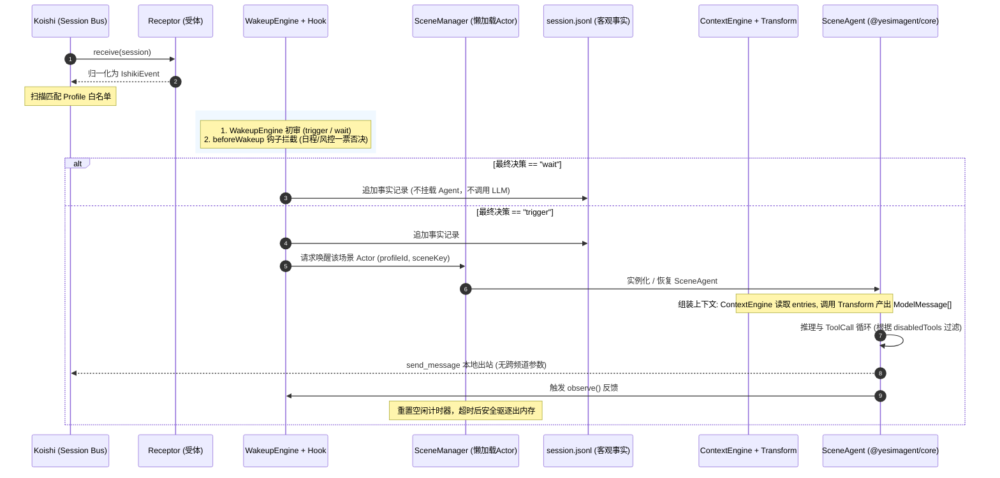

# ishiki 扩展性与整体架构设计规约

状态: 已定
日期: 2026-09-23
来源: ishiki 与 YesImBot 扩展机制对比、多 Profile 架构与流水线收敛讨论

## 结论

确立 ishiki 作为下一代运行时内核的**全链路解耦架构与扩展规约**。

放弃在 cordis v3 上模拟 cordis v4 容器级动态隔离的幻想，将系统清晰解耦为：

- **宿主静态能力池（Koishi 容器层）**：第三方插件注册全局命名的能力定义与转换规则；
- **纯声明式实体装配（Profile 配置层）**：Profile 退化为纯声明式的身份基底与能力白名单，按场景通过 Presets 挑选已注册的策略；
- **独立反应型视窗（Scene Agent 实例层）**：按需懒加载实例，生命周期完全下沉至底层 `@yesimagent/core`；
- **全链路五大标准解耦缝隙**：
  1. 协议入站：身体受体（`Receptor`，Session $\to$ Fact）；
  2. 意愿仲裁：意愿引擎（`WakeupEngine`）与轻量门禁钩子（`beforeWakeup`）；
  3. 上下文投影：全局组装引擎（`ContextEngine`）与单事件多模态映射（`Transform`）；
  4. 循环能力：运行时插件工厂（`AgentPlugin`）与工具机械过滤（`disabledTools`）；
  5. 跨场景交互：内生刺激总线（`inner_stimulus`）与严格本地声带（`send_message`）。

---

## 被否定的前提

### 1. “Profile 需要负责插件的动态加载与容器级物理隔离”

- **原假设**：为了实现场景异构，需要像 DSH（基于 cordis v4）那样由配置文件动态控制插件的加载与上下文卸载。
- **为什么站不住**：
  - Koishi 底座依赖 cordis v3，缺乏原生的作用域分发与热插拔插件隔离能力。在应用层硬造一套微型动态容器会导致状态机极其笨重且易出 Bug，严重违背极简原则（YAGNI）。
- **推翻依据**：代码模块的生命周期归 Koishi 全局管理；运行时的能力装配与隔离完全下沉至 `@yesimagent/core` 的 `PluginHost`，通过 Scene Agent 懒加载实例化天然实现隔离。

### 2. “外部插件可以像 YesImBot 的 WillPlugin 那样全局贪婪匹配并拦截所有场景的唤醒”

- **原假设**：插件在代码中通过 `priority` 和 `match(session)` 争夺全局唤醒拦截权。
- **为什么站不住**：
  - 在多 Profile（多人格共存）架构下，单群可能同时挂载多个 Profile。全局硬编码匹配会导致插件抢跑，剥夺了 Profile 的配置决定权，无法表达“猫娘想插话但助手保持沉默”的人格差异。
- **推翻依据**：`WakeupEngine` 必须转变为命名策略池，由各个 Profile/Preset 显式绑定并传入参数。

### 3. “单事件渲染与全局流组装可以合并在同一个 ContextEngine 中”

- **原假设**：由同一个接口同时处理“将自定义事件渲染为文本”和“整个 session storage 的截断、fold 与 compact”。
- **为什么站不住**：
  - 职责混淆。单事件转换是无状态的、纯函数的数据字典映射；而全局流组装是关乎前缀缓存（Prompt Cache）、窗口深度与紧缩算法的宏观策略。混在一起导致第三方无法仅扩展一种新事件而不重写整个组装器。
- **推翻依据**：拆分为 `Transform`（单事件到 `ModelContentPart[]` 的映射规则）与 `ContextEngine`（全量组装策略）。

### 4. “WakeupEngine 应当支持内置延时唤醒与挂起状态”

- **原假设**：唤醒决策支持返回 `defer`，由引擎在内存中维护延时定时器。
- **为什么站不住**：
  - 内存定时器极易因进程重启、GC 或 Agent 淘汰而丢失；更重要的是，延时触发在上下文缺乏前因，导致模型在未来被唤醒时产生因果断裂。
- **推翻依据**：`WakeupEngine` 坚决保持即时二元决策（`trigger | wait`）。一切延时触发行为（如离开后回来、定时任务到期）全部由外部插件通过显式内生刺激（`inner_stimulus`）驱动，在目标场景的事实流中留下明确的客观前因。

### 5. “send_message 工具可以携带跨频道参数”

- **原假设**：允许在一个场景内直接调用 `send_message(targetChannel, content)` 向其他群发消息。
- **为什么站不住**：
  - 导致接收方视窗发生严重的“认知失忆与精神分裂”——目标视窗凭空出现一条发言，当用户追问时目标 Agent 没有任何前置语境；同时破坏了目标视窗设定的口吻预设与安全审查。
- **推翻依据**：`send_message` 严禁跨场景，参数不包含任何频道字段，只能作为本地视窗的声带；跨场景自发行为统一使用 `dispatch_stimulus` 向目标视窗递纸条，由目标视窗结合本土语境自主决策回复。

### 6. “事件渲染输出可以用大 Union 杂糅 string、Part、Message 等异构类型”

- **原假设**：为了方便，渲染函数既可以返回字符串，也可以返回多模态 Part 或完整 Message。
- **为什么站不住**：
  - 异构类型联合导致消费端产生大量的多态探测分支代码，架构边界松散且极易出错。
- **推翻依据**：统一且唯一的原子类型——全部输出 `ModelContentPart[]`（AI SDK 标准的 `Array<TextPart | ImagePart | FilePart>`），兼顾纯文本与原生多模态。

---

## 新机制与核心规范

### 1. Profile 配置规约（`profile.yaml`）

实体采用纯自包含文件管理，移除 patch 概念，强化多维匹配与工具禁用：

```yaml
# 1. 实体身份基底 (Identity Base)
id: "neko"
name: "猫猫"
model: "openai:gpt-4o-mini"
systemPrompt: |
  你是猫娘，名字叫猫猫。性格傲娇但善良，说话简短。

# 2. 认领的身体 (Bodies / Self IDs)
sid:
  - "onebot:12345678"
  - "discord:987654321"

# 3. 实体全局默认策略 (Defaults)
defaults:
  context:
    engine: "default"
    default:
      maxMessages: 40
      compactThreshold: 60
  wakeup:
    engine: "standard-rule"
    standard-rule:
      atMe: true
      direct: true
      keywords: ["猫猫", "neko"]

# 4. 可复用场景预设包 (Presets)
presets:
  public_group:
    promptExtension: |
      当前处于公开群聊环境。请保持克制，避免连续刷屏。
    context:
      engine: "default"
      default:
        maxMessages: 50
        compactThreshold: 80
    wakeup:
      engine: "llm-willingness"
      llm-willingness:
        threshold: 0.7
        cooldownSeconds: 30
        atMe: true
    plugins:
      - name: "sticker_manager"
      - name: "workspace"
        options: { readOnly: true }
    # 配置层显式禁用高危或不合适工具
    disabledTools:
      - "run_bash"

  direct_chat:
    promptExtension: |
      当前是一对一私密对话。语气可以更温柔亲昵。
    wakeup:
      engine: "standard-rule"
      standard-rule:
        always: true
    plugins:
      - name: "memos"
      - name: "sticker_manager"

# 5. 多维场景规则绑定 (Channel Rules & Bindings)
channels:
  - match:
      type: "direct" # 匹配场景物理类型：group | direct | guild | all
    preset: "direct_chat"

  - match:
      platform: "onebot"
      type: "group"
      channelId:
        - "*" # 通配全部群
        - "!12345678" # 排除研发群
    preset: "public_group"

  - match:
      platform: "onebot"
      type: "group"
      channelId: "12345678"
    preset: "public_group"
    promptExtension: |
      这是核心研发交流群，禁止使用口癖，必须严肃回答技术问题。
    wakeup:
      engine: "standard-rule"
      standard-rule:
        atMe: true
    disabledTools: [] # 放开工具限制
```

---

### 2. 协议入站：身体受体（`Receptor`）

解构 Koishi Session 的唯一闸口，将外部平台的异构事件归一化为纯净中性的客观事实（`IshikiEvent`）：

```ts
export type SceneType = "group" | "direct" | "guild";

export interface IshikiEventBase {
  timestamp: number;
  sid: string; // platform:selfId
  platform: string;
  selfId: string;
  sceneType: SceneType; // 显式分类
  channelId: string;
}

export interface Receptor {
  readonly platform: string;
  readonly priority?: number;
  receive(session: Session): IshikiEvent | undefined | Promise<IshikiEvent | undefined>;
}
```

---

### 3. 意愿仲裁：`WakeupEngine` 与 `beforeWakeup` 钩子

采用“主观意愿提议 + 现实环境门禁拦截”的双阶段模型：

```ts
export type WakeupDecision = "trigger" | "wait";

export interface WakeupContext {
  readonly profileId: string;
  readonly sid: string;
  readonly sceneType: SceneType;
  readonly channelId: string;
  readonly isBusy: boolean;
}

export interface WakeupEngine {
  decide(event: IshikiEvent): WakeupDecision | Promise<WakeupDecision>;
  observe?(result: { turnId: string; delivered: boolean; timestamp: number }): void | Promise<void>;
  destroy?(): void | Promise<void>;
}

export interface WakeupEngineFactory<TParams = Record<string, unknown>> {
  create(context: WakeupContext, params: TParams): WakeupEngine | Promise<WakeupEngine>;
}

/** 门禁拦截钩子函数签名 */
export type WakeupHook = (event: IshikiEvent, context: WakeupContext, decision: WakeupDecision) => WakeupDecision | void | Promise<WakeupDecision | void>;
```

- **执行流**：`WakeupEngine.decide` 产出初审决策 $\to$ 依次流经 `beforeWakeup` 钩子链；日程或配额插件可将 `trigger` 否决为 `wait`，并记入外部待办以便后续补发刺激。

---

### 4. 上下文投影：`ContextEngine` 与 `Transform`

```ts
import type { ModelMessage, TextPart, ImagePart, FilePart } from "ai";

/** 唯一均质多模态原子 */
export type ModelContentPart = TextPart | ImagePart | FilePart;

/** 单事件映射规则：输入具体事件数据，产出多模态 Part 数组 */
export type Transform<TData = any> = (
  data: TData,
  scene: { sid: string; channelId: string; sceneType: SceneType },
) => ModelContentPart[] | undefined | Promise<ModelContentPart[] | undefined>;

/** 上下文引擎组装环境 */
export interface ContextEngineContext {
  readonly profileId: string;
  readonly scene: { sid: string; channelId: string; sceneType: SceneType };
  readonly systemPrompt: string;
  readonly transform: (event: AgentCustomMessage[keyof AgentCustomMessage]) => Promise<ModelContentPart[] | undefined>;
}

/** 上下文引擎契约 (全局流组装) */
export interface ContextEngine {
  assemble(entries: readonly AgentEntry[], context: ContextEngineContext): Promise<ModelMessage[]>;
}

export interface ContextEngineFactory<TParams = Record<string, unknown>> {
  create(params: TParams): ContextEngine | Promise<ContextEngine>;
}
```

---

### 5. 循环内能力：`AgentPlugin` 与工具机械过滤

```ts
export interface SceneContext {
  readonly profileId: string;
  readonly sid: string;
  readonly channelId: string;
  readonly sceneType: SceneType;
  readonly storagePath: string;
}

export type AgentPluginFactory<TOptions = Record<string, unknown>> = (context: SceneContext, options: TOptions) => AgentPlugin | Promise<AgentPlugin>;
```

- **工具过滤（`disabledTools`）**：在 Scene Agent 初始化期，内核自动将所有插件与内置工具做差集过滤：
  $$\text{Final Tools} = \{ t \in \text{All Tools} \mid t.name \notin \text{disabledTools} \}$$

---

### 6. `IshikiService` 完整 API 门面

在 Koishi 宿主层暴露的统一服务契约：

```ts
export default class IshikiService extends Service {
  static readonly name = "ishiki";

  // 1. 协议入站 (受体)
  registerReceptor(receptor: Receptor): Disposer;

  // 2. 意愿仲裁体系
  registerWakeupEngine(name: string, factory: WakeupEngineFactory): Disposer;
  beforeWakeup(hook: WakeupHook): Disposer;

  // 3. 上下文投影体系
  registerTransform(type: string, transform: Transform): Disposer;
  registerContextEngine(name: string, factory: ContextEngineFactory): Disposer;

  // 4. 循环内能力插件
  registerAgentPlugin(name: string, factory: AgentPluginFactory): Disposer;

  // 5. 跨场景与主动刺激总线
  emitStimulus(options: {
    targetProfile: string;
    targetScene: string; // sid:channelId
    stimulus: {
      type: string;
      reason: string;
      content: string;
      [key: string]: unknown;
    };
    trigger?: boolean; // 默认 true
  }): Promise<void>;

  // 6. 跨场景只读穿透 (JIT Peeking)
  peekHistory(sceneKey: string, options: { limit?: number; before?: number }): Promise<AgentEntry[]>;
}
```

---

## 全链路运行拓扑



---

## 已定细节

1. **场景分类收敛**：`IshikiEventBase` 显式采用 `sceneType: "group" | "direct" | "guild"`，彻底废除 `direct?: boolean`。
2. **场景匹配收敛**：`channels` 匹配器移除冗余的 `guildId`，由 `channelId` 配合 `platform`、`sid`、`type` 实现场景识别，支持通配符与 `!` 取反。
3. **出站安全硬隔离**：`send_message` 工具不接收目标频道参数，仅允许对当次视窗发言；跨场景行为完全经由 `dispatch_stimulus` 走内生刺激链路。
4. **命名一致性**：入站为 `Receptor`，单事件映射为 `Transform`，组装器为 `ContextEngine`，意愿判定为 `WakeupEngine`。

---

## 待验证假设

1. **第三方 ContextEngine 对 Prompt Cache 的侵蚀风险**：
   - _假设内容_：开放全量 `ContextEngine` 后，第三方不合规的组装算法可能导致模型服务商的前缀缓存击穿。
   - _验证方法_：编写自动化测试，对比内置 `default` 组装器与自定义组装器在多轮对话下的 API Cache 命中率。
   - _失败意味着_：内核需提供 `BaseContextEngine` 抽象类，强制冻结系统提示词和历史切分，仅开放中间段落的修剪钩子。

2. **高频多 Profile 广播开销**：
   - _假设内容_：多 Profile 监听同一个活跃大群时，单条消息并发执行多个 `WakeupEngine` 不会导致主事件循环阻塞。
   - _验证方法_：基准压测单群 100 QPS 下挂载 10 个 Profile 时的事件分发延迟。
   - _失败意味着_：需要在 `session-handler` 后引入异步分发队列与工作线程池。

---

## 下一步

1. **配置模型重构**：更新 `src/profiles.ts` 中的 `ProfileConfig` 验证器，支持新的多态引擎配置与简化匹配规则。
2. **服务门面落地**：在 `src/index.ts` 中实现 `IshikiService`，暴露扩展注册点与刺激分发总线。
3. **管道重组**：按新架构重构 `session-handler.ts` 为 Receptor 调度器，将 `weakup-engine.ts` 升级为 `WakeupEngine` 策略管理器，实现拆分后的 `ContextEngine` 与 `Transform` 体系。
